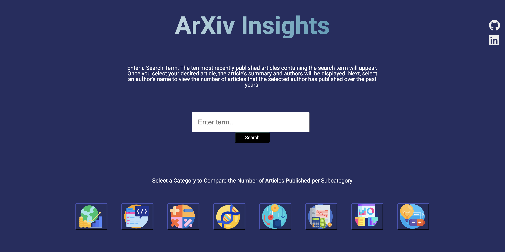

# Background

ArXiv Insights is a data visualization tool that allows users to compare article data obtained from the ArXiv. The tool provides interactive visualizations to explore and analyze patterns, trends, and insights within the articles and different categories.

### What is ArXiv?

ArXiv is an online repository that houses a wide range of scientific research papers across disciplines. It serves as a platform for researchers to share their preprints before formal peer review and publication. With a vast collection of freely accessible papers, ArXiv enables researchers, students, and academics to stay informed about the latest developments in their fields and facilitates collaboration. 

### Home Page 

# Functionality

The ArXiv Insights will allow users to:

- Search for a article by entering keywords or phrases. Users will also be able refine the search results, through filters such as  category, date range, authors, or institutions.

- View detailed information of the selected article by selecting the information icon in the tool bar to the right. 

- Visualize information about the author of the selected article, such as name and number of other articles published by the same author by clicking the author icon in the tool bar. 

- Visualize a timeline of the updates made to the selected article by selecting an icon on the tool bar.

-  Compare article metrics such as citation counts, download counts, and publication dates.

- Compare number of publications over time by category 

- Visualize the correlation between article categories and publication dates 

In addition, this project will include:
- A production README

# Wireframes

- Nav links include links to this project's Github repo and Linkdeln.

- On the right, there will be a tool bar with clickable icons based on what the user wants to know.

- On the left, three will be a categories nav bar with clickable icons for information on each category

- A search bar that allows the user to search for an article, and filter menu to refine results. 

# Technologies, Libraries, APIs

This project will be implemented with the following technologies:

- The Arxiv API will be used as the data source
- Webpack and Babel to bundle and transpile the source JavaScript code
- npm to manage project dependencies

# Implementation Timeline

## NB:

- Friday Afternoon & Weekend: Setup project, including getting webpack up and running. Explore the ArXiv API documentation and understand the available endpoints and data structure. Implement the data retrieval mechanism to fetch article data from the ArXiv API using the provided API key.

- Monday: Continue fetching article data from the ArXiv API. Design and create the basic visualization components, such as the search bar, article grid, and filters.

- Tuesday: Implement the initial visualization elements, such as basic charts or graphs, to display article data and integrate visualization libraries to create more advanced and dynamic charts or graphs.

- Wednesday: Work on styling and enhance the visualization components by adding interactive features, such as hover effects or tooltips. Test the application for any bugs or usability issues and perform necessary bug fixes.

- Thursday Morning: Deploy to GitHub pages. 

# Bonus Features

- Social Sharing: Buttons or icons to share articles or visualizations on social media platforms or via email

- Bookmarking or Saving: Option to bookmark or save articles of interest for later reference Ability to create collections or folders to organize saved articles